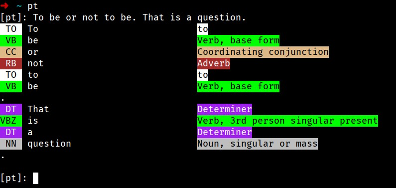

PT - A Part-of-speech (POS) Tagging CLI
=======================================

**PT** is a CLI POS tagging tool that help user to
tag out the sentence from command line and print the
result prettily.

It is based on [nltk](https://www.nltk.org/) for POS tagging,
and [zdict](https://github.com/zdict/zdict) for dictionary lookup.





How to use
----------

## One sentence

```
$ pt "This is a sentence"
 DT  This                           Determiner
VBZ  is                             Verb, 3rd person singular present
 DT  a                              Determiner
 NN  sentence                       Noun, singular or mass
```

## Interactive

When entering a sentence, it will shows the tagging result. When entering a word,
it will shows the zdict lookup result.

```
$ pt
[pt]: Once performed by hand, POS tagging is now done in the context of computational linguistics
 RB  Once                           Adverb
VBN  performed                      Verb, past participle
 IN  by                             Preposition or subordinating conjunction
 NN  hand                           Noun, singular or mass
,
NNP  POS                            Proper noun, singular
 NN  tagging                        Noun, singular or mass
VBZ  is                             Verb, 3rd person singular present
 RB  now                            Adverb
VBN  done                           Verb, past participle
 IN  in                             Preposition or subordinating conjunction
 DT  the                            Determiner
 NN  context                        Noun, singular or mass
 IN  of                             Preposition or subordinating conjunction
 JJ  computational                  Adjective
NNS  linguistics                    Noun, plural

[pt]: using algorithms which associate discrete terms
VBG  using                          Verb, gerund or present participle
 NN  algorithms                     Noun, singular or mass
WDT  which                          Wh-determiner
VBP  associate                      Verb, non-3rd person singular present
 NN  discrete                       Noun, singular or mass
NNS  terms                          Noun, plural

[pt]: part-of-speech
part of speech
  ph. 【文】詞類；詞性

[pt]:
```
